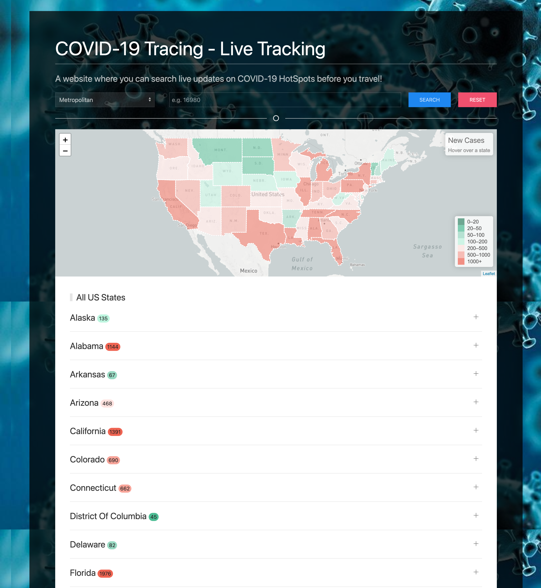

# Covid Catcher
Covid Catcher is a web application that allows users to check Covid-19 situation before visiting a place. It integrates data received from [Covid Act Now API](https://api.covidactnow.org/).

## GitHub Pages link
https://alapsraval.github.io/covid-catcher/

## Built With
* HTML/CSS
* Vanilla JS
* [UI Kit](https://getuikit.com/)
* [LeafletJS](https://leafletjs.com)
* API - [Covid Act Now API](https://api.covidactnow.org/)

## Features
* Drop down and search box to search by State name, County name or Metropolitan area code (aka fips).
* Interactive map with color coding to visualize Covid-19 new cases.
* Reset button to start over search.
* Local storage to retain selected option after page refresh.
* Make it more mobile friendly.

## Roadmap
* Allow users to search by keywords (e.g. user should be able to look for Illinois cases by typing "IL" or "Illin").
* Show county and metropolitan areas on the map.
* Show spinner when loading large data set.

## Screenshots

